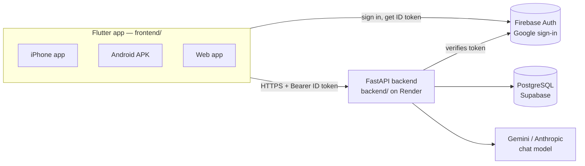

# Movara — Developer Guide

The single source of truth for how Movara is built, where every feature lives,
and how to add or change things. If this guide and the code disagree, the code
wins — then fix this guide in the same commit.

**Contents**

1. [What Movara is](#1-what-movara-is)
2. [Architecture](#2-architecture)
3. [Repository map](#3-repository-map)
4. [Branches and where they deploy](#4-branches-and-where-they-deploy)
5. [Feature map — where each feature lives](#5-feature-map--where-each-feature-lives)
6. [Data — what lives where](#6-data--what-lives-where)
7. [Running it locally](#7-running-it-locally)
8. [Adding a new feature](#8-adding-a-new-feature)
9. [Changing an existing feature](#9-changing-an-existing-feature)
10. [Shipping a change (release checklist)](#10-shipping-a-change-release-checklist)
11. [Secrets and configuration](#11-secrets-and-configuration)
12. [Troubleshooting and known gotchas](#12-troubleshooting-and-known-gotchas)
13. [Conventions](#13-conventions)

---

## 1. What Movara is

A workout and running tracker, one Flutter codebase shipped three ways plus a
backend:

| Surface | How users get it | Updates |
|---|---|---|
| **Web app** | https://movara-app.pages.dev | Automatic within minutes of a deploy |
| **Android app** | APK from the `android-latest` GitHub release (Account → Download App) | User re-downloads the APK; installs over the old one, keeps data |
| **iPhone app** | Installed from the Mac with `./run-ios.sh` (no App Store yet) | Reinstall from the Mac |
| **Backend API** | https://movara-backend-h22y.onrender.com/api | Render auto-deploys from `main` |

Main features: category-based workout logging with PRs, a gym session timer,
GPS run/walk/hike recording with maps and share cards, goals and streaks,
badges, reminders with active hours, AI gym-motivation notifications, a
leaderboard, an AI fitness assistant, Apple Health steps (iOS), and an iOS
Lock Screen / Dynamic Island timer.

## 2. Architecture



- **Auth:** the app signs in with Google through Firebase and sends the
  Firebase **ID token** as `Authorization: Bearer …` on every API call. The
  backend verifies it (`backend/app/auth.py`) and scopes all data to that user.
- **Local-first UI:** the app keeps a lot on the device (runs, goals, reminders,
  workout sessions) in `shared_preferences`, and syncs to the backend what
  other people or other devices need (workout entries, run summaries, profile).
- **Free-tier backend:** Render sleeps after ~15 min idle and takes 30–50 s to
  wake. `ApiService._resilient` retries transient failures so the app rides out
  the cold start.

## 3. Repository map

```
movara/
├── README.md                 Short intro → points here
├── render.yaml               Render blueprint for the backend (rootDir: backend)
├── docs/DEVELOPER_GUIDE.md   ← this file
├── .github/
│   ├── workflows/deploy-frontend.yml   Web build → Cloudflare Pages (movara-app)
│   ├── workflows/android-apk.yml       Signed APK → emulator smoke test → GitHub release
│   └── scripts/android-smoke.sh        Installs + launches the APK on the CI emulator
├── backend/                  FastAPI + SQLAlchemy (PostgreSQL)
│   ├── app/main.py           App, CORS, 422→400 mapping, router registration
│   ├── app/config.py         All environment variables
│   ├── app/auth.py           Firebase ID-token verification → current_uid
│   ├── app/db.py             Tables, _migrate() column adds, exercise seeding
│   ├── app/models.py         Pydantic request/response models (camelCase JSON)
│   ├── app/routers/          One file per area (see §6 endpoints)
│   ├── tests/                pytest (DB tests need PostgreSQL, else skip)
│   ├── Dockerfile            What Render runs
│   └── run-local.sh          Gitignored: local run with your DATABASE_URL
└── frontend/                 Flutter app
    ├── lib/
    │   ├── main.dart         Firebase init, theme, AuthGate
    │   ├── screens/          One file per screen/tab (see §5)
    │   ├── services/         State stores, API client, platform integrations
    │   ├── models/           Data classes (JSON ↔ Dart)
    │   ├── widgets/          Reusable UI pieces
    │   └── theme/            AppTheme (fonts) + MovaraColors (palette tokens)
    ├── test/                 flutter test suite
    ├── ios/                  Xcode project, incl. MovaraLiveActivity widget extension
    ├── android/              Android project (package com.avneesh.movara_app)
    ├── docs/LIVE_ACTIVITY.md How the iOS Live Activity target is set up
    ├── run-ios.sh            Build + install on the connected iPhone
    ├── build-web.sh          Local web build with firebase.env
    └── serve-web.sh          Build + serve web on http://localhost:8099
```

## 4. Branches and where they deploy

| Branch | Purpose | Pushing it triggers |
|---|---|---|
| `python-backend-integration` | **Working branch.** All work is committed here first. | Nothing |
| `first-build` | App release branch. Fast-forwarded from the working branch. | **Web deploy** (`deploy-frontend.yml`) + **Android APK** (`android-apk.yml`), when `frontend/**` or the workflow files change |
| `main` | Backend release branch. Fast-forwarded from the working branch. | **Render backend deploy** (auto-deploy on push) |

Everything moves forward by fast-forward, so the three branches never diverge:

```bash
git push origin python-backend-integration                 # save work
git push origin python-backend-integration:main            # deploy backend
git push origin python-backend-integration:first-build     # deploy web + Android
```

## 5. Feature map — where each feature lives

The app shell is `frontend/lib/screens/home_shell.dart`: it creates the shared
stores, owns the list of workout entries, and holds the bottom tabs in this
order: **Home, Workout, Activity, Reminders, Feed (leaderboard), Account**. The
floating ✨ button opens the AI assistant.

| Feature | UI | Logic / state | Backend | Tests |
|---|---|---|---|---|
| Google sign-in | `screens/auth_gate.dart`, `sign_in_screen.dart` | `services/auth_service.dart`, `firebase_config.dart`, `main.dart` | `app/auth.py` | `test/api_auth_test.dart` (token on every call), backend `tests/test_auth.py` |
| Home dashboard (streak, Today/Week rings, stats, achievements, weekly chart) | `screens/home_tab.dart` | `WeekStats` in `home_tab.dart`, `services/goal_store.dart`, `run_store.dart` | workout entries | `test/tabs_test.dart`, `weekly_chart_test.dart` |
| Goal rings | `widgets/dual_goal_ring.dart`, `goal_ring.dart` | `services/goal_store.dart` (weekly goals; daily = ÷7) | — (on device) | `tabs_test.dart` |
| Badges | `widgets/badges_grid.dart` (grid + Longest Workout chip), shown in `home_tab.dart` and `account_tab.dart` | `services/badges.dart` → `computeBadges()` | — (derived) | `test/workout_log_test.dart` |
| Workout logging (categories, exercises, sets, PR chips, category ticks) | `screens/workout_session.dart` | exercise catalog `_workoutData` + `_categories` in the same file; set sync queue in `_ExerciseCardState` | `routers/workout_entries.py` | `tabs_test.dart`, `set_toggle_test.dart` |
| Start / Finish Workout + session timer | `WorkoutSessionCard` in `screens/workout_tab.dart`; header chip in `home_shell.dart`; `widgets/workout_timer_bar.dart` | `services/workout_timer.dart`, `workout_log.dart` | — (on device) | `workout_timer_test.dart`, `workout_log_test.dart` |
| Workout history | `screens/workout_history.dart`, `widgets/workout_entry_card.dart` | entries from the shell; `models/workout_entry.dart` | workout entries | `test/widget_test.dart` |
| Run / Walk / Hike recording, map, splits | `screens/running_tab.dart`, `widgets/route_map.dart`, `route_path.dart` | `services/run_tracker.dart` (GPS), `run_store.dart` | `routers/runs.py` (summaries + restore) | `test/running_test.dart` |
| Share card / photo overlay | `widgets/share_card.dart`, `overlay_card.dart` | `services/share_image*.dart` (web/native split) | — | `running_test.dart` |
| iOS Lock Screen / Dynamic Island timer | native: `ios/MovaraLiveActivity/`, `ios/Shared/MovaraActivityAttributes.swift`, `ios/Runner/LiveActivityBridge.swift` | `services/live_activity.dart`; started by `running_tab.dart` and `workout_timer.dart` | — | `test/workout_live_activity_test.dart` |
| Apple Health steps / heart rate (iOS only) | Account → Connected Apps; steps tile in `home_tab.dart` | `services/health_service.dart` | — | — |
| Reminders with active hours | `screens/reminders_tab.dart` | `services/reminder_scheduler.dart`, `models/reminder.dart` (`upcomingTimes()`), `services/water_notifications*.dart` | — (on device, OS-scheduled) | `reminders_test.dart`, `reminder_hours_test.dart` |
| Gym motivation (morning/evening, AI text) | Account → Health → Gym Motivation | `services/motivation_reminders.dart` | `routers/chat.py` (writes the message) | `tabs_test.dart` |
| Leaderboard ("Feed" tab) | `screens/leaderboard_tab.dart` | `models/leaderboard_entry.dart` | `routers/social.py` | — |
| AI assistant (✨ button) | `screens/feed_tab.dart` | `services/chat_controller.dart` | `routers/chat.py` | backend `tests/test_chat.py` |
| Account: username, profile photo, body stats, toggles, download app | `screens/account_tab.dart` | `services/api_service.dart` | `routers/social.py` (profile, photo) | `profile_photo_test.dart`, `tabs_test.dart` |
| Theme (light/dark, colours, fonts) | `theme/app_theme.dart`, `theme/movara_colors.dart` | toggled in `main.dart` | — | `test/theme_test.dart` |

**Finding anything else:** `grep -rn "Visible text on screen" frontend/lib`
lands you in the right file almost every time.

## 6. Data — what lives where

### On the server (PostgreSQL, `backend/app/db.py`)

| Table | Holds | Notes |
|---|---|---|
| `exercises` | Exercise names + categories | Seeded on first start |
| `workout_entries` | Every logged set (per user) | Source of truth for streaks, stats, PRs, history |
| `runs` | Run summaries (date, time, distance) | Routes stay on the device; used to restore after reinstall and for leaderboard points |
| `profiles` | Display name, username, `photo_url`, `photo_custom` | Upserted by the app on every launch |
| `profile_photos` | Uploaded photo bytes | Separate so leaderboard queries don't load images |

**API endpoints** (all under `/api`, all require the Bearer token unless noted):

| Method | Path | Router |
|---|---|---|
| GET / POST | `/exercises` | `exercises.py` |
| GET / POST | `/workout-entries` · DELETE `/workout-entries/{id}` | `workout_entries.py` |
| GET / POST | `/runs` | `runs.py` |
| PUT | `/profile` · GET `/profile/me` · GET `/profile/username-available` | `social.py` |
| PUT / DELETE | `/profile/photo` · GET `/profile/photo/{userId}` (**public**) | `social.py` |
| GET | `/leaderboard` | `social.py` |
| POST | `/chat` · `/chat/stream` | `chat.py` |

Interactive docs: run the backend locally and open `http://localhost:8080/docs`.

### On the device only (`shared_preferences`)

These are **not synced** — they're per device and reset if the app is deleted
(runs are the exception: summaries are restored from the server).

| Key(s) | Owner | What |
|---|---|---|
| `saved_runs` | `services/run_store.dart` | Full runs incl. GPS route |
| `workout_sessions` | `services/workout_log.dart` | Finished Start/Finish Workout sessions |
| `workout_timer_*` | `services/workout_timer.dart` | The running session timer |
| `goal_*` | `services/goal_store.dart` | Weekly goals |
| `reminders_v2`, `reminders_seeded_v1` | `services/reminder_scheduler.dart` | Reminders + active hours |
| `gym_motivation_*`, `toggle_Gym Motivation` | `services/motivation_reminders.dart` | Motivation times + on/off |
| `toggle_*`, `body_*`, `health_connected` | `screens/account_tab.dart` | Settings toggles, body stats |

> If you want one of these on every device (e.g. workout sessions on the
> leaderboard), it needs a backend table + endpoint — see recipe C below.

## 7. Running it locally

**Prerequisites:** Flutter 3.47.5 (CI is pinned to this), Xcode (for iOS),
Python 3.12+ (backend). No Android SDK is needed — Android builds in CI.

**Backend**

```bash
cd backend
python3 -m venv .venv && .venv/bin/pip install -r requirements.txt -r requirements-dev.txt
./run-local.sh          # gitignored; sets DATABASE_URL etc. and runs uvicorn on :8080
.venv/bin/python -m pytest tests -q   # DB tests skip without a reachable PostgreSQL
```

**Frontend**

```bash
cd frontend
flutter test                 # full suite (~120 tests)
flutter analyze
./serve-web.sh               # web build on http://localhost:8099 (needs firebase.env)
flutter run -d chrome        # quick web dev loop (hot reload with r / R)
./run-ios.sh                 # release build + install on the connected iPhone
```

The app talks to `http://localhost:8080/api` by default. To use the deployed
backend instead, pass
`--dart-define=API_BASE_URL=https://movara-backend-h22y.onrender.com/api`
(`run-ios.sh` and CI already do).

## 8. Adding a new feature

### The general steps (every feature)

1. **Decide where the data lives** (see §6): derived from existing data? on the
   device only? needs the server so other devices/users see it?
2. **Backend first** if it needs the server (recipe C). Add tests.
3. **App model + API call** in `lib/models/` and `lib/services/api_service.dart`.
4. **State:** a `ChangeNotifier` store in `lib/services/` if several screens
   share it (recipe B); otherwise local `State` in the screen.
5. **UI** in the right screen (use §5), reusing `widgets/` and theme tokens.
6. **Tests:** a unit test for the logic and a widget test at phone width
   (375 px) — this catches overflow bugs early.
7. `flutter analyze && flutter test` (and backend `pytest`) all green.
8. **Update this guide** (§5 feature map, §6 data) in the same commit.
9. **Ship** with the §10 checklist.

### Recipe A — UI-only feature (e.g. a new card on Home)

1. Build it as a widget in `lib/widgets/` (or a private widget in the screen file).
2. Use `context.movara` colours and `AppTheme.display(...)` for headings —
   never hard-coded colours (see §13).
3. Insert it where it belongs in the screen's `build` (e.g. the `ListView`
   children in `home_tab.dart`).
4. Widget test at 375 px width; `expect(tester.takeException(), isNull)`.

### Recipe B — feature with its own on-device state

Pattern used by `GoalStore`, `WorkoutLog`, `RunStore`, `ReminderScheduler`:

1. Create `lib/services/my_store.dart`: a `ChangeNotifier` with `load()`,
   mutating methods that `notifyListeners()` and persist to
   `SharedPreferences` under a **new, unique key**.
2. In `home_shell.dart`: add `final _myStore = MyStore();`, call
   `_myStore.load()` in `initState`, `_myStore.dispose()` in `dispose`, and pass
   it to the tabs that need it.
3. In the screen, rebuild with
   `AnimatedBuilder(animation: _myStore, builder: …)` (or
   `Listenable.merge([...])` for several stores).
4. Test the store directly with `SharedPreferences.setMockInitialValues({})`
   (see `test/workout_log_test.dart`).
5. If you change a stored format later, **read the old format too** (see how
   `Reminder.fromJson` defaults missing fields) so existing users don't lose data.

### Recipe C — feature that needs the server

1. **Table:** add or extend a model class in `backend/app/db.py`.
   - A **new table** is created automatically at startup (`create_all`).
   - A **new column on an existing table** also needs an idempotent
     `ALTER TABLE … ADD COLUMN IF NOT EXISTS …` in `_migrate()` — `create_all`
     does not add columns.
2. **API shapes:** Pydantic models in `backend/app/models.py` (camelCase field
   names — that's the JSON the app speaks).
3. **Endpoint:** in a router under `backend/app/routers/` (new file → add
   `app.include_router(...)` in `main.py`). Take `uid: str = Depends(current_uid)`
   and **always filter by `uid`** — a user must never see another user's rows
   (`tests/test_user_isolation.py` guards this).
4. **Tests** in `backend/tests/` (copy the style of `test_social.py`).
5. **App side:** a method in `api_service.dart` (wrap in `_resilient` for
   retries; check the right status code with `_checkOk(..., expected: …)`),
   then the UI.
6. **Deploy order matters:** push `main` first and **wait until the new endpoint
   answers** (e.g. `curl` it), *then* push `first-build`. An app that calls a
   missing endpoint just shows errors.

### Recipe D — a new bottom tab

1. Create `lib/screens/my_tab.dart`.
2. In `home_shell.dart`, add it to the `IndexedStack` children **and** to
   `_TabBar._items` (icon + label) at the same position.
3. Tabs are indexed by position — check `_onTab` and any
   `widget.onOpenTab?.call(n)` in `account_tab.dart` that jump to a tab by number.

### Recipe E — a new exercise or category

- Exercises live in `_workoutData` in `lib/screens/workout_session.dart`; each
  `_Exercise` has an `id` (unique, kebab-case), `name`, `muscle`, default `sets`,
  `steps`, `icon` and two `images` (start/end frames).
- Images come from the public-domain free-exercise-db:
  `https://raw.githubusercontent.com/yuhonas/free-exercise-db/main/exercises/<Folder>/0.jpg`
  (and `1.jpg`). Check the URL returns 200; a broken image falls back to the icon.
- A new category: add it to `_categories` and a key in `_workoutData`.
- Keep exercise **names unique** — PRs, "done today" ticks and category
  highlighting match logged entries by name.

### Recipe F — a new badge

1. Add a `BadgeInfo` in `computeBadges()` in `lib/services/badges.dart`
   (unique `id`, emoji `icon`, `label`, `earned` rule, `progress` 0..1).
2. If it needs a new number, add it to `BadgeStats` and fill it in both
   places that build stats: `_badgeStats` in `home_tab.dart` and `_badges` in
   `account_tab.dart`.
3. Test the rule in `test/workout_log_test.dart`.

### Recipe G — a new notification type

- Scheduling goes through `WaterNotifications` (`water_notifications.dart`
  picks the web/native/stub implementation).
- **IDs:** repeating reminders use `baseId * 1000 + n`; **daily** notifications
  (like gym motivation) must use IDs **≥ 900000**
  (`WaterNotifications.dailyIdFloor`) or reminder rescheduling will cancel them.
- iOS keeps at most **64** pending notifications; reminders share a budget of 48.
- Times use the phone's timezone (`flutter_timezone`); don't build `DateTime`s
  in UTC for user-facing times.

### Recipe H — native iOS changes

- Permissions / usage strings: `frontend/ios/Runner/Info.plist`.
- Live Activity: see `frontend/docs/LIVE_ACTIVITY.md`. If you add a field to
  `MovaraActivityAttributes`, update both the bridge (`LiveActivityBridge.swift`)
  and the widget (`MovaraLiveActivityWidget.swift`).
- Native changes need a full `./run-ios.sh` (hot reload won't pick them up).

### Recipe I — Android-specific changes

- Manifest / permissions: `frontend/android/app/src/main/AndroidManifest.xml`.
- Build settings: `frontend/android/app/build.gradle.kts` (minSdk **26** — the
  `health` plugin requires it).
- `MainActivity` **must** extend `FlutterFragmentActivity` — the `health`
  plugin crashes the app on launch otherwise.
- You can't build Android locally; push and read the CI result (§12 explains
  how to read errors). The emulator smoke test refuses to publish an APK that
  crashes on launch; its screenshot is attached to the release.

## 9. Changing an existing feature

1. Find it in the §5 feature map (or `grep` the text you see on screen).
2. Read the file's doc comments — they explain *why* things are the way they
   are, including past bugs (e.g. why ticks are local-first in
   `workout_session.dart`).
3. Run that feature's tests before you change anything, so you know they were
   green to begin with.
4. Make the change; update or add tests for the new behaviour.
5. If you change **stored data formats** (§6), keep reading the old format.
6. If you change an **API response**, keep old fields until every client
   (web, Android, iPhone) has shipped the update.
7. Update this guide if you moved or renamed anything, then ship (§10).

## 10. Shipping a change (release checklist)

```bash
# 1. Green locally
cd frontend && flutter analyze && flutter test
cd ../backend && .venv/bin/python -m pytest tests -q     # if backend changed

# 2. Commit and save on the working branch
git add -A && git commit -m "…" && git push origin python-backend-integration

# 3. Backend changed? Deploy it first and wait until it's live
git push origin python-backend-integration:main
curl https://movara-backend-h22y.onrender.com/api/…   # the new endpoint answers

# 4. App: web + Android (CI)
git push origin python-backend-integration:first-build
#    → check both runs succeed in GitHub → Actions
#      ("Deploy frontend to Cloudflare Pages", "Build Android APK")

# 5. iPhone (phone connected + unlocked)
cd frontend && ./run-ios.sh
```

**Never say "deployed" from the push alone** — confirm the GitHub Action run
ended in `success`, and for the web that https://movara-app.pages.dev shows the
change (hard-refresh with ⌘⇧R).

## 11. Secrets and configuration

**Never commit secrets or paste them in chat.** Everything below is either in a
gitignored file on the Mac or in a dashboard.

| Where | Name | What / how to change |
|---|---|---|
| GitHub → Settings → Secrets → Actions | `CLOUDFLARE_API_TOKEN` | Cloudflare **User** API token with Account · Cloudflare Pages · Edit, Account Settings · Read, User · User Details · Read, User · Memberships · Read |
| 〃 | `FIREBASE_API_KEY`, `FIREBASE_AUTH_DOMAIN`, `FIREBASE_PROJECT_ID`, `FIREBASE_APP_ID`, `FIREBASE_MESSAGING_SENDER_ID` | Firebase **web** app config (Firebase console → Project settings → Your apps → Web) |
| 〃 | `ANDROID_SIGNING` | base64 tar.gz of `android/key.properties` + `android/app/upload-keystore.jks` |
| 〃 | `GOOGLE_SERVICES_JSON` | base64 of `android/app/google-services.json` |
| Render → service → Environment | `DATABASE_URL`, `FIREBASE_PROJECT_ID`, `ALLOWED_ORIGINS` (currently `*`), `CHAT_PROVIDER`, `GEMINI_API_KEY` / `ANTHROPIC_API_KEY`, `CHAT_MODEL` | Backend config (`backend/app/config.py`) |
| Mac, gitignored | `frontend/firebase.env` | Firebase web config for local web builds |
| Mac, gitignored | `frontend/ios/Runner/GoogleService-Info.plist` | Firebase iOS config |
| Mac, gitignored | `frontend/android/app/google-services.json` | Firebase Android config |
| Mac, gitignored | `frontend/android/key.properties` + `app/upload-keystore.jks` | **Android release key** — backed up in `~/.movara-android-signing/`. **Losing it means the Android app can never be updated.** Keep a second backup somewhere safe. |
| Mac, gitignored | `backend/run-local.sh` | Local backend env (DB URL, keys) |

**Firebase settings that matter:**

- Authentication → Settings → **Authorized domains** must include every web
  domain (currently `movara-app.pages.dev`) or Google sign-in fails with
  `auth/unauthorized-domain`.
- The Android app (`com.avneesh.movara_app`) must list the release key's
  **SHA-1** `BF:9F:34:6F:16:9E:E9:62:16:06:82:15:54:8C:94:7E:4E:BD:F3:23`, or
  Google sign-in fails with `DEVELOPER_ERROR`. After adding a fingerprint,
  re-download `google-services.json` and update the `GOOGLE_SERVICES_JSON` secret.

**To give a secret to GitHub without showing it:** copy it to the clipboard,
e.g. `pbcopy < frontend/firebase.env`, then paste into the secret field.

## 12. Troubleshooting and known gotchas

| Symptom | Cause / fix |
|---|---|
| App shows "Couldn't reach the backend" or loads slowly after being idle | Render free tier cold start (30–50 s). Wait; the app retries. |
| iPhone install fails with `Connection reset by peer` / NWError 54 | Transient USB/Wi-Fi drop. The build is fine — re-run `xcrun devicectl device install app --device <id> frontend/build/ios/iphoneos/Runner.app`. |
| Can't read a failed GitHub Action's log | Logs need a GitHub login; annotations don't. The workflows echo the real error as `::error::` (`WRANGLER_*_FAIL`, `APK_BUILD_FAIL`, `SMOKE_FAIL`) — read them on the run page or via the API `check-runs/<job>/annotations`. |
| GitHub API returns "rate limit exceeded" | 60 unauthenticated requests/hour. Poll every 45–60 s, not faster. |
| Web deploy fails with `Authentication error [code: 10000]` | Cloudflare token missing a permission (see §11). |
| Web shows a grey screen | A crash before the first frame — usually a build missing the `FIREBASE_*` defines. Check the browser console. |
| Web: Google sign-in `auth/unauthorized-domain` | Add the domain in Firebase Authorized domains. |
| Android APK crashes on launch | Most likely `MainActivity` isn't `FlutterFragmentActivity`, or a plugin's minSdk is too high. The smoke test will say so. |
| `flutter create` changed `pubspec.lock` | It re-resolves packages (can downgrade). Restore with `git checkout -- frontend/pubspec.lock`. |
| Notifications arrive at the wrong time | Timezone not initialised — `water_notifications_native.dart` sets `tz.local` from `flutter_timezone`. |
| Gym motivation notifications vanish | Something cancelled them — use `cancelAll()` (which spares IDs ≥ 900000), never the plugin's blanket cancel. |
| Live Activity appears then disappears | Ending "all activities" inside `start()` — only end activities that existed *before* the new request (see `LiveActivityBridge.swift`). |
| Old Cloudflare project `movara-9ol` | Retired (Git-connected projects can't take Direct Upload). The live site is `movara-app`. |

## 13. Conventions

- **Colours:** always `context.movara.<token>` (`accent`, `surface`, `textPrimary`,
  …) from `theme/movara_colors.dart`, so light/dark both work. No hard-coded
  colours except white text on accent buttons.
- **Headings:** `AppTheme.display(...)` (Syne); body text uses the theme default.
- **Layout:** design for a 375 px wide phone first. In rows with text + buttons,
  let the text flex (`Expanded` / `FittedBox(fit: BoxFit.scaleDown)`) instead of
  a `Spacer`, and add a widget test at 375 px.
- **Tests:** every bug fix gets a test that fails without the fix (see
  `test/set_toggle_test.dart` for reproducing race conditions with a slow fake
  server).
- **Comments:** explain *why* (the constraint, the past bug), not *what*.
- **Commits:** one logical change per commit; the message says what changed and
  why. Commits made with Claude end with a `Co-Authored-By` line.
- **Secrets:** never in git, never in chat (see §11).
